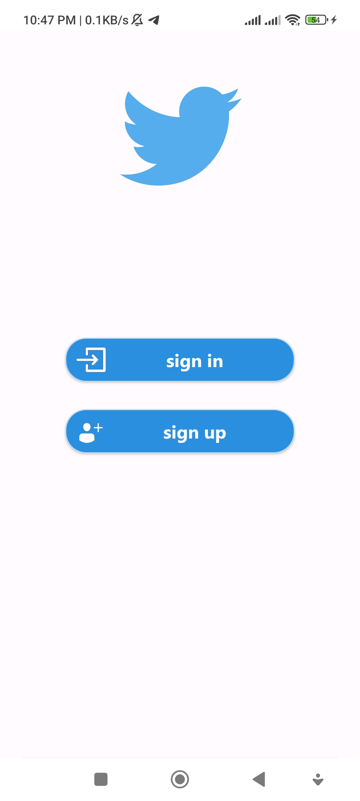
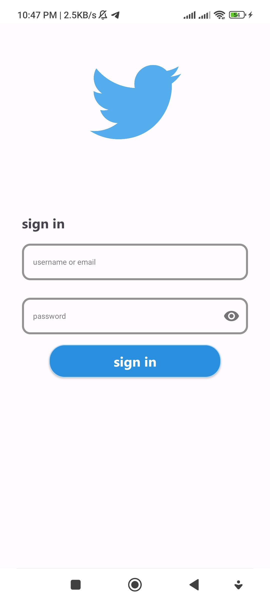
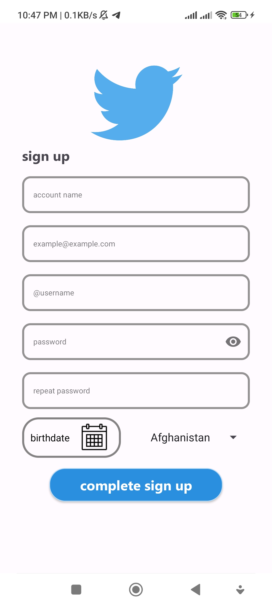
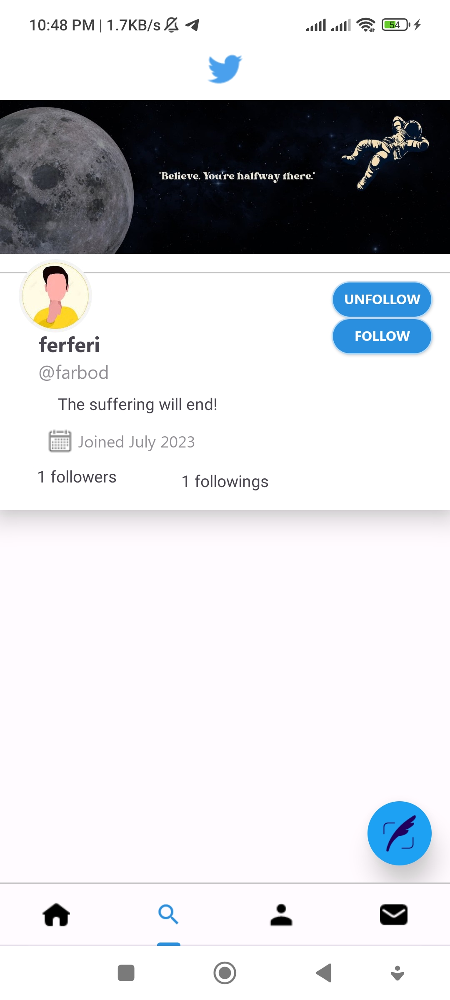
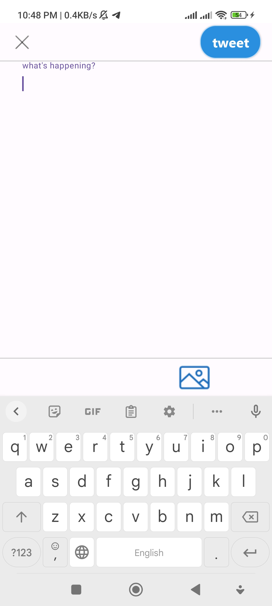
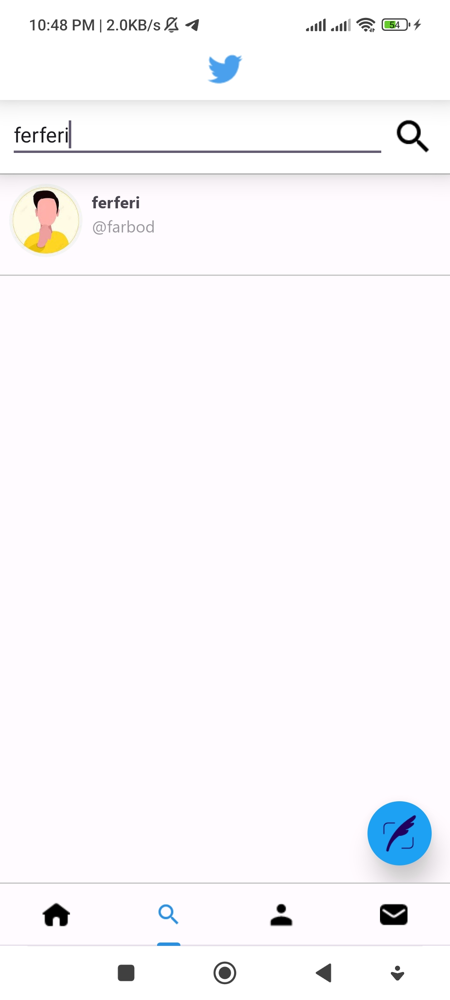

# Title: Twitter Android Client

## Description

This is a simplified version of android Twitter app written in java, which was created as a GUI client for [**Twitter-Server**](https://github.com/farbodbj/Twitter-Server). The two projects together made the final project for my advanced programming course at [**AUT**](https://www.topuniversities.com/universities/amirkabir-university-technology)

## Stack

| Tools | Link |
|     :---      |          :---: |
| 🤖 Java | [Java](https://openjdk.org/projects/jdk/19/) |
|📃 XML|[App layouts](https://developer.android.com/develop/ui/views/layout/declaring-layout)|
| 🌐 Material Design | [Material Design](https://developer.android.com/jetpack/androidx/releases/compose-material) |
| 🖼️ Glide | [Media management](https://github.com/bumptech/glide) |

## Design Process

As the first step, the essential methods for calling related API endpoints were created, these methods would send an Http request with the agreed-on format between the client and the server and provide the neccessary success or failiure callbacks for using the response.

After the client essential methods were created and tested thoroughly, the navigation graph for the app was written, the needed activities and fragments were identified, then while creating each fragment or activity, the UI design of the related layouts was implemented using XML, along with any adapters, view holders or other neccessary components.

## Visuals (Light Theme):
### Screenshots
<table style="width:100%">
  <tr>
    <th>Startup</th>
    <th>Sign in</th> 
    <th>Sign up</th>
    <th>Timeline</th>
  </tr>
  <tr>
    <td></td> 
    <td></td>
    <td></td> 
    <td></td>
  </tr>
  <tr>
    <th>User profile</th>
    <th>Write tweet</th>
    <th>Search user</th>
  </tr>
  <tr>
    <td></td>
    <td></td>
    <td></td>
  </tr>
</table>

## Contributing:

Feel free to submit pull requests. For major changes, please open an issue first to discuss what you would like to change.
